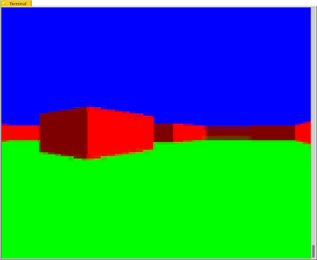

# Notray

## Huh ?
I had an itch.  I love a good TUI and I've been wanting to play with the rather awesome [notcurses](https://notcurses.com/) for a while.  A couple of weekends ago I decided to put some effort in and scratch that itch.

I wanted to play with widgets and windows as those are probably the things I'd want to use this library for.  I was expecting something like `ncurses` forms and windows, but it looks like there's not much in the way of those more mundane elements yet - `notcurses` is all about the bling.

I didn't want to spend the time writing my own TUI toolkit and get lost in (yet another) large and long-running project.  Something quick and simple was needed to kick the tyres and explore the library - so obviously..._a raycaster_ !

## First Steps
The screenshot is the 'Hello, World !' - a very basic raycaster running in a 120x41 character terminal on my FreeBSD desktop.  It's rudimentary but there's enough interesting stuff to commit and push.

## Next Steps
I'll iterate on this for as long as I can be bothered.  I certainly want to add texture-mapping as I'm really interested in seeing how `notcurses` renders that.  The things that are 'on the list', in no particular order, are:
- [ ] Collision Detection
- [x] A proper colour palette to allow shading
- [ ] Texture-mapped walls
- [ ] Texture-mapped floors and ceilings
- [ ] Transparent areas in walls (ie. windows)
- [ ] A sky map
- [ ] Objects
- [ ] Doors
- [ ] Switches and other interactive elements
- [ ] Frame timing for proper motion, speed, animation and control
- [ ] [Playdate](https://play.date/) !
- [ ] Web Assembly - it's on my to-do pile to take a goosey at some point

Making some kind of game would be cool, but it's a long way off and I prefer procrastinating by writing daft READMEs like this one.  It'd be something novel and original.  Some kind of zombie thing set in a graveyard maybe, like the awesome [Catacomb Abyss](https://github.com/CatacombGames) from back in the day.  I'd call it _Wake_.  It works on so many levels.  Obviously it'd be a great success and need a sequel or two, so there'd be _Wake (Tomb)_ and _Wake, Thee...! (Arachnia)_ as well.  Yeah.

## Design Choices
I'll be honest - there wasn't much design with this, it's basically just been hacked together.  It's a playground.  The code has almost wanton disregard and deliberately poor performance on today's speculative multi-gigglyhertz multi-core cache-centric monsters.  You won't find none of them fancy floating points or heap allocations here.

I've kept the core `no_std` and based mainly around 16-bit fixed-point, with the expectation that any realistic target will be 32-bit.  Single-cycle multiplication is also an assumption, so I've not tried too hard to eliminate those - division only where necessary, though.  These are guiding principles though since most optimisations will be done at the time of porting, since there's no point doing it before there's something to measure.

I want to try this out on a Playdate (eventually), which is why the initial canvas is 400x240 pixels.  The Playdate has better specs than anything in the early 90s so I also want to port it to more modest devices, so keeping one eye on memory usage and stuffing things into `.rodata` is also important.  Lookup tables are used but sparingly - it's the age-old balance between memory and cycle counts.  A quick back-of-the-envelope calculation shows I'm not going to be running this in a few KiB though - a single 64x64 256-colour texture takes 4KiB.
